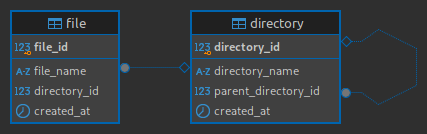

# Virtual Files System Application
Este projeto tem como finalidade simular um gerenciador de pastas e arquivos virtuais(sem fazer upload do conteúdo deles).

## Tecnologias utilizadas:

- Java 22
- SpringBoot 3.3.3
- SwaggerAPI 3.0.0
- FlyWay Migration 10.18.0
- JaCoCo(Java Code Coverage) 0.8.12
- PostgreSQL latest version
- NodeJS 18.18.2
- Angular 17.3.0
- Docker

## O que a aplicação contempla?
Esta aplicação contempla as tecnologias mais utilizadas do mercado, como base de dados foi utilizado o PostgreSQL, fazendo a melhor modelagem do banco de dados, no BackEnd Java 22, uma das versões mais recentes do Java, usando as melhores tecnologias para o desenvolvimento, sendo elas: SpringBoot para a API REST, SwaggerAPI para documentação de API, FlyWay para realizar as migrations no banco de dados e JaCoCo para realizar a cobertura dos testes do código. Já no FrontEnd, foi utilizado o framework Angular com componentização a partir da biblioteca Material, aplicando as melhores práticas de sites estáticos.

## Modelo Relacional do Banco de Dados


# Guia de uso do projeto:
## Pré-requisitos

Antes de começar, você precisa ter estes serviços instalados em sua máquina:

- [Docker](https://www.docker.com/get-started)
- [Docker Compose](https://docs.docker.com/compose/install/)

## Como fazer o build da aplicação

Para iniciar a aplicação, basta direcionar-se a pasta 'docker' localizada na raiz do projeto. Para subir os conteineres abra o terminal na pasta e execute o seguinte comando:
```bash
docker-compose up --build
```

Prontinho! Após o build você tera acesso ao frontend pela url 'http://localhost:4200' e o backend na url 'http://localhost:8080'

# Informações adicionais
## Banco de dados
Caso haja interesse em acessar o banco de dados, é possível acessar o mesmo com as seguintes credenciais:
```
Nome do Banco: file_system
Usuário: postgres
Senha: postgres
Porta: 5432
```

## Visualização dos endpoints
Para melhor visualização dos endpoints da API, recomendo que utilize o swagger do projeto, presente na url: 'http://localhost:8080/swagger-ui/index.html'

Mas ainda sim, recomendo utilizar o Insomnia(ou a aplicação que for mais familiarizado), ir até a raiz do projeto e acessar a pasta 'documentation' e depois 'insomnia-collection' importando então o arquivo 'insomnia-collection.json'. Este arquivo trará todas as requests da aplicação direto para o Insomnia, facilitando assim o uso da API.